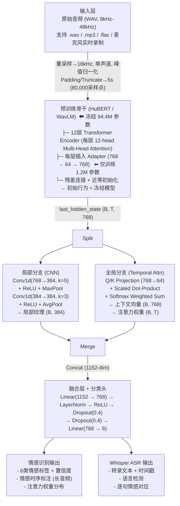
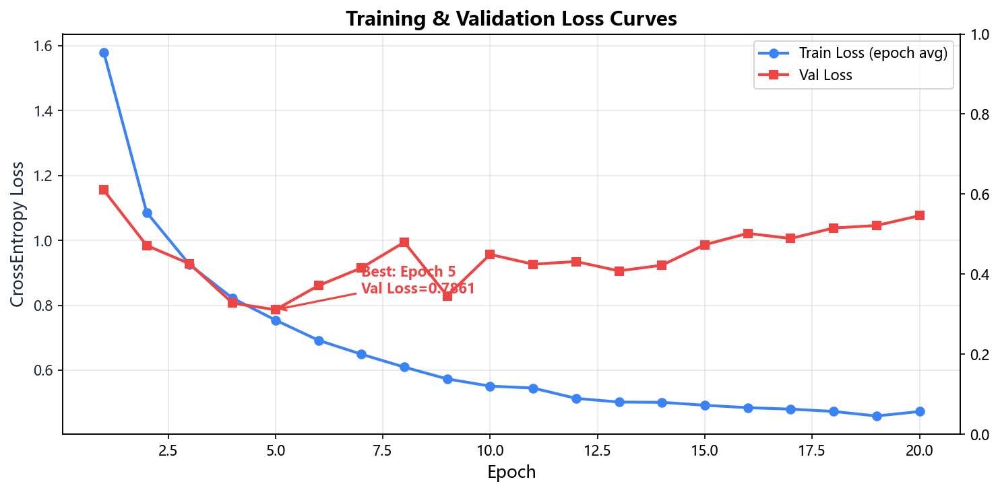
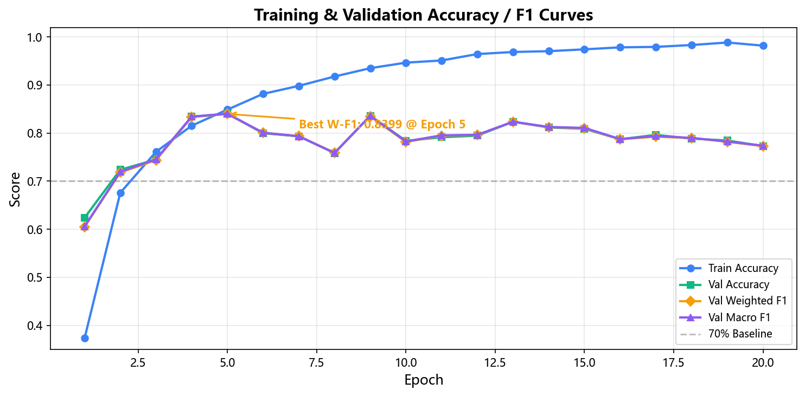
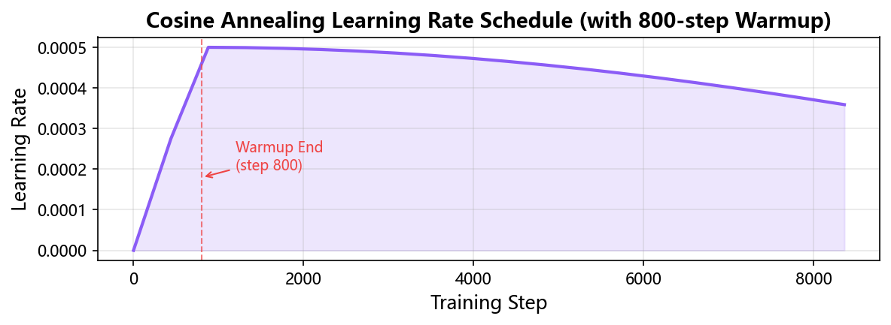
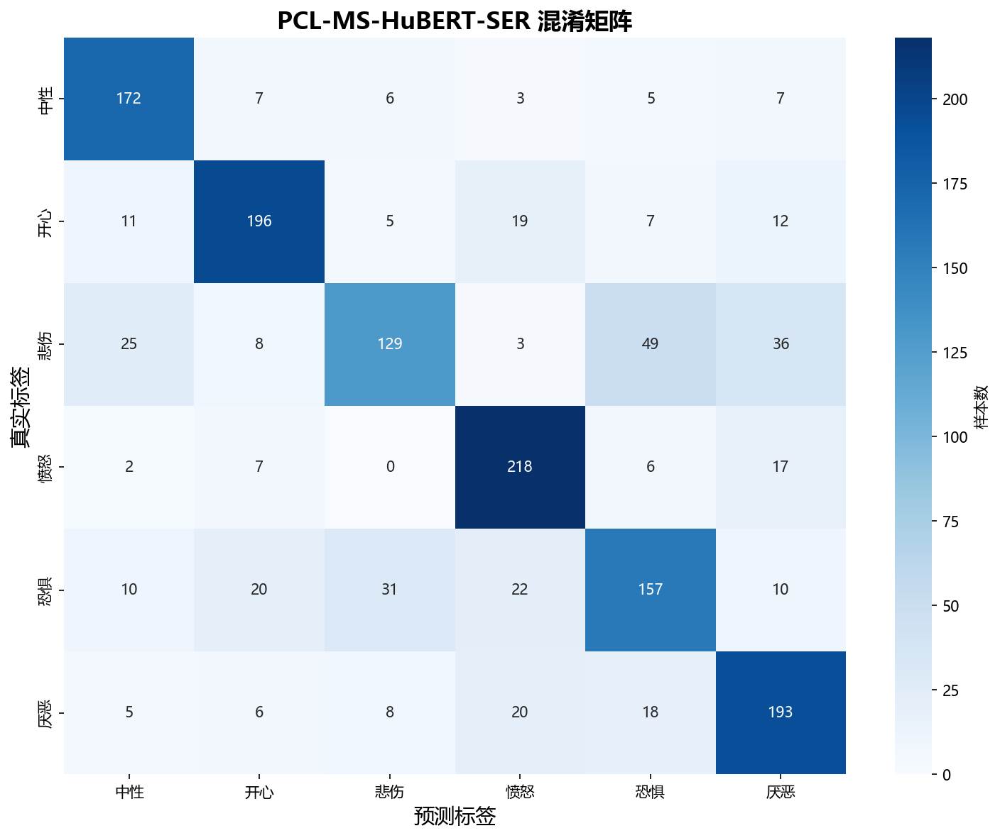
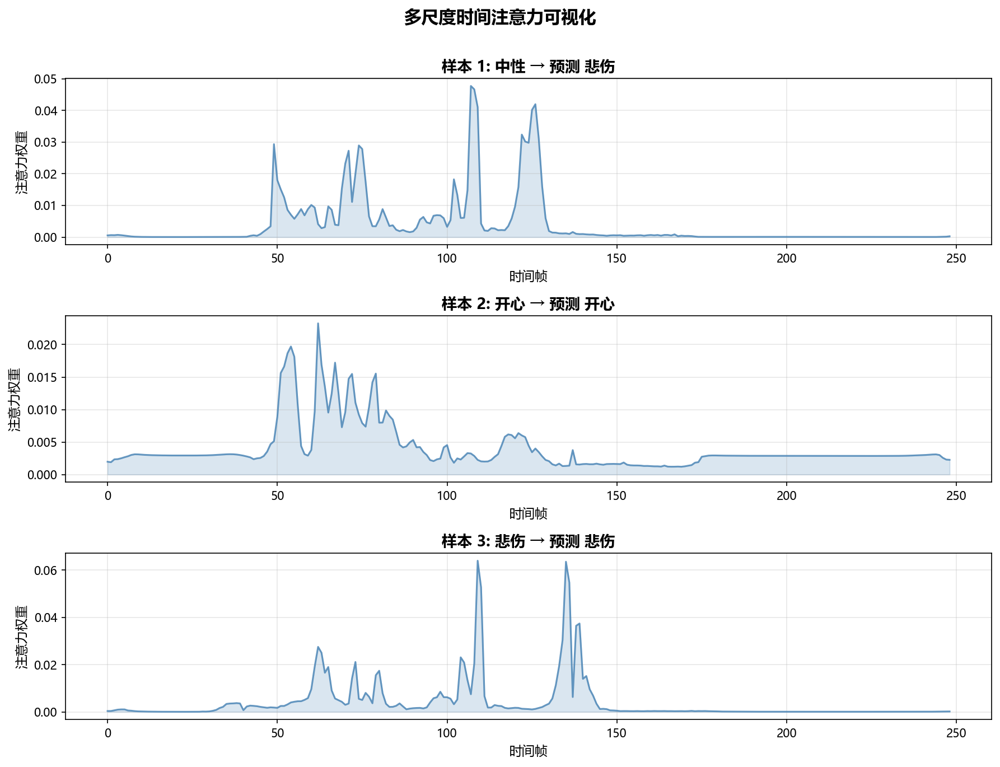
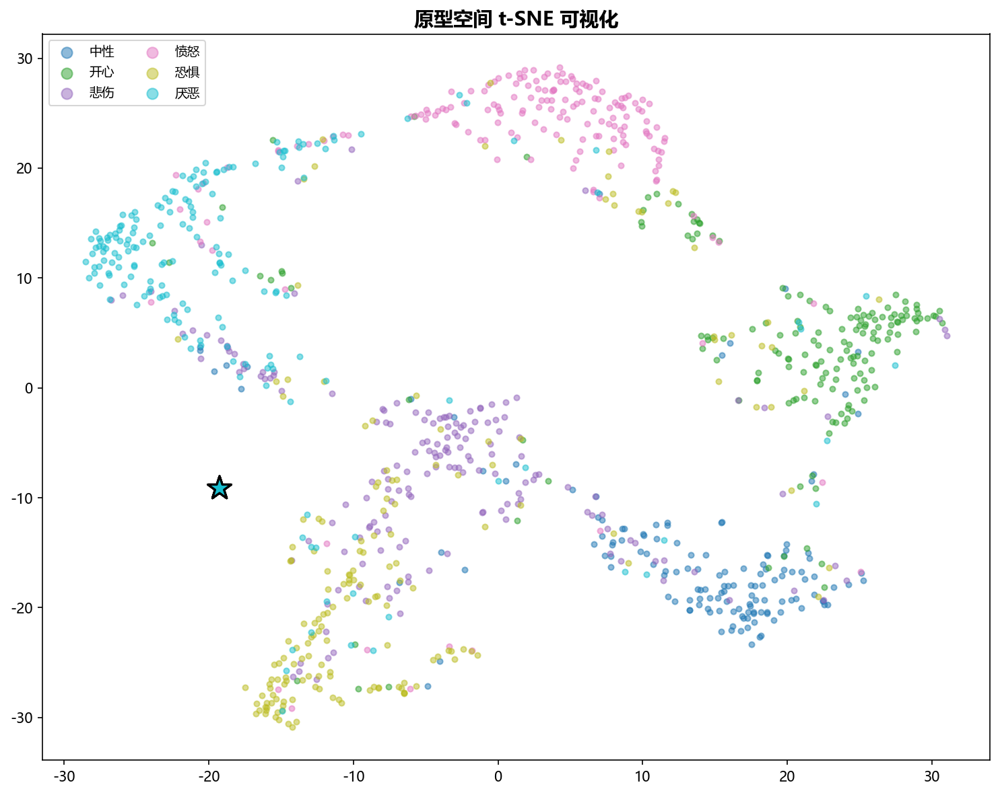

# MSA-SER-ASR：多尺度语音情感识别与转录分析系统

### 基于预训练模型 Adapter 迁移学习、多尺度时间建模与集成语音识别

**小组成员**：*熊烨 吴颂钊 吴彦霖* &emsp; 

---

## 摘要

本课题构建了一个端到端的**多尺度语音情感识别与转录分析系统（MSA-SER-ASR）**。系统以预训练 WavLM 为声学特征骨干，采用 Adapter 参数高效微调（仅 1.2M 可训练参数）实现跨数据集的迁移学习，通过 CNN 局部分支与 Self-Attention 全局分支构成"微观纹理 + 宏观韵律"的多尺度时间建模。联合 RAVDESS、CREMA-D、TESS 三个英文情感语音数据集（共 10,898 条），按严格说话人独立原则划分训练/验证/测试集，在 1,450 条测试样本上达到 **73.5% 准确率和 0.732 Macro F1**。系统同时集成 Whisper ASR 引擎，构建了基于 Gradio 的双模式交互界面（短音频即时分析 + 长音频滑动窗口情感时序标注），提供一站式语音情感识别与内容转录服务。

**关键词**：语音情感识别（SER），迁移学习，Adapter 微调，多尺度建模，WavLM，Whisper ASR，Gradio

---

## 目录

- [1. 任务背景与目标](#1-任务背景与目标)
  - [1.1 课题来源与动机](#11-课题来源与动机)
  - [1.2 具体目标](#12-具体目标)
  - [1.3 系统功能概览](#13-系统功能概览)
- [2. 理论知识回顾](#2-理论知识回顾)
  - [2.1 预训练模型的迁移学习与参数高效微调](#21-预训练模型的迁移学习与参数高效微调)
  - [2.2 注意力机制与多尺度时间建模](#22-注意力机制与多尺度时间建模)
  - [2.3 对比学习与原型理论](#23-对比学习与原型理论)
  - [2.4 正则化与小样本学习](#24-正则化与小样本学习)
- [3. 系统设计与架构](#3-系统设计与架构)
  - [3.1 总体架构](#31-总体架构)
  - [3.2 核心模块设计](#32-核心模块设计)
  - [3.3 开发环境与依赖](#33-开发环境与依赖)
- [4. 数据工程](#4-数据工程)
  - [4.1 数据集概览](#41-数据集概览)
  - [4.2 预处理流程](#42-预处理流程)
  - [4.3 说话人独立划分](#43-说话人独立划分)
  - [4.4 数据分布统计](#44-数据分布统计)
- [5. 实验方法与过程](#5-实验方法与过程)
  - [5.1 实验设计总览](#51-实验设计总览)
  - [5.2 阶段一：基准实验与 Curriculum Learning 探索](#52-阶段一基准实验与-curriculum-learning-探索)
  - [5.3 阶段二：多数据集扩展](#53-阶段二多数据集扩展)
  - [5.4 阶段三：Adapter 参数高效微调](#54-阶段三adapter-参数高效微调)
  - [5.5 阶段四：消融与对比实验](#55-阶段四消融与对比实验)
  - [5.6 阶段五：ASR 集成与应用构建](#56-阶段五asr-集成与应用构建)
  - [5.7 最终训练配置](#57-最终训练配置)
- [6. 实验结果与分析](#6-实验结果与分析)
  - [6.1 测试集整体性能](#61-测试集整体性能)
  - [6.2 各类别性能分析](#62-各类别性能分析)
  - [6.3 混淆矩阵分析](#63-混淆矩阵分析)
  - [6.4 注意力可视化分析](#64-注意力可视化分析)
  - [6.5 特征空间可视化（t-SNE）](#65-特征空间可视化tsne)
  - [6.6 对比实验汇总](#66-对比实验汇总)
  - [6.7 错误样本分析](#67-错误样本分析)
- [7. 应用演示系统](#7-应用演示系统)
  - [7.1 短音频分析模式](#71-短音频分析模式)
  - [7.2 长音频分析模式](#72-长音频分析模式)
  - [7.3 技术实现细节](#73-技术实现细节)
- [8. 项目工程化实践](#8-项目工程化实践)
  - [8.1 项目目录结构](#81-项目目录结构)
  - [8.2 配置管理体系](#82-配置管理体系)
  - [8.3 实验追踪与复现](#83-实验追踪与复现)
- [9. 问题讨论与反思](#9-问题讨论与反思)
  - [9.1 关键经验教训](#91-关键经验教训)
  - [9.2 目标达成回顾](#92-目标达成回顾)
  - [9.3 改进方向](#93-改进方向)
- [10. 总结与展望](#10-总结与展望)
- [参考文献](#参考文献)
- [附录](#附录)

---

## 一. 任务背景与目标

### 1.1 课题来源与动机

语音是人类最自然、最丰富的情感载体之一。让机器从语音信号中理解情感——即**语音情感识别（Speech Emotion Recognition, SER）**——是情感计算与智能人机交互领域的核心研究课题。SER 技术在心理健康监测（如情绪障碍早期筛查）、智能客服质检（如客户满意度实时评估）、教育反馈分析（如在线课堂参与度检测）等场景中具有广泛的应用前景[1]。

然而，情感语音数据的标注成本远高于普通语音识别数据。现实中的开源数据集规模普遍较小：RAVDESS 仅含约 1,400 条样本，TESS 约 2,400 条，即便是最大的 CREMA-D 也仅约 7,400 条。在如此有限的数据上直接训练深度模型极易发生严重过拟合[2]。

本课题探索的核心问题是：

> **如何利用大规模预训练模型的通用声学知识，在小规模多源情感数据上实现可靠的情感识别，同时为用户提供一站式的语音分析体验（情感识别 + 内容转录）？**

课题源于课程中学习的迁移学习、注意力机制、对比学习等理论知识。个人动机在于将这些理论落地为一个从数据工程、模型设计、训练调优到应用部署的完整全栈系统。

### 1.2 具体目标

| 编号 | 目标 | 评估标准 | 完成状态 |
|------|------|---------|:-------:|
| G1 | 掌握预训练模型的参数高效迁移学习方法（Adapter 微调） | 模型正常加载预训练权重，训练过程收敛 | ✅ |
| G2 | 构建多尺度时间建模架构，在 6 类情感分类任务上达到 >70% 准确率 | 测试集准确率 > 70% | ✅ (73.5%) |
| G3 | 联合三个异构开源数据集，实现严格说话人独立的训练/测试划分 | 测试说话人与训练集完全无重叠 | ✅ |
| G4 | 对比不同训练策略（冻结 vs Adapter，CE vs Focal Loss，HuBERT vs WavLM） | 完成 ≥4 组对照实验并记录分析 | ✅ (5 组) |
| G5 | 集成语音识别（ASR），构建可交互的双模式演示系统 | Gradio 界面正常运行，正确返回情感和转录结果 | ✅ |

### 1.3 系统功能概览

本系统提供两大核心功能模块：

- **短音频分析（Short Audio）**：用户上传或录制一段短音频（≤5 秒），系统即时返回情感识别结果（6 类情感置信度）、Whisper 转录文本、音频波形图以及模型的时间注意力分布图。
- **长音频分析（Long Audio）**：用户上传任意长度的语音文件（如对话录音、演讲），系统以 4 秒滑动窗口（步长 3 秒）逐段分析，输出情感时序标注图、带情感底色的逐句转录文本、以及情感分布饼图。

---

## 二. 理论知识回顾

### 2.1 预训练模型的迁移学习与参数高效微调

**迁移学习（Transfer Learning）** 通过将在大规模源任务上学到的知识复用到数据稀缺的目标任务，大幅降低对标注数据的需求[1]。在语音领域，自监督预训练模型（如 HuBERT、WavLM）通过在 960 小时无标注语音上执行掩码预测任务，学习到了通用的声学-语音学表示。

本课题使用的两个骨干模型：

| 模型 | 参数规模 | 预训练数据 | 核心特点 |
|------|---------|-----------|---------|
| **HuBERT-base** (Hsu et al., 2021)[3] | 94.4M | LibriSpeech 960h | 通过离线 K-Means 聚类生成伪标签，迭代预测隐藏单元 |
| **WavLM-base-plus** (Chen et al., 2022)[4] | 94.4M | LibriSpeech + GigaSpeech 等，94k 小时 | 引入语音去噪和说话人识别辅助任务，对情感和语速变化更敏感 |

本课题采用 **Adapter 参数高效微调（Parameter-Efficient Fine-Tuning, PEFT）** 策略：冻结全部 94.4M 预训练参数，仅在每层 Transformer 后插入轻量级瓶颈 Adapter 模块（共 1.2M 参数），再训练分类头（约 2.9M）。总计可训练参数约 4.1M，仅占全模型的 ~4.3%，在保留通用声学知识的同时高效适配情感任务。

Adapter 的核心结构为：

$$\text{Adapter}(x) = W_{up} \cdot \text{GELU}(W_{down} \cdot x) + x$$

其中 $W_{down} \in \mathbb{R}^{768 \times 64}$，$W_{up} \in \mathbb{R}^{64 \times 768}$，瓶颈维度 64 可将参数压缩 12 倍。关键技巧是**近零初始化**——将 Adapter 权重初始化为正态分布 $\mathcal{N}(0, 10^{-8})$，确保训练初期 Adapter 输出接近零，模型行为 ≈ 完全冻结的预训练模型，从而避免训练初期的梯度震荡。

### 2.2 注意力机制与多尺度时间建模

Transformer 架构的核心是**缩放点积注意力（Scaled Dot-Product Attention）**[5]：

$$Attention(Q,K,V) = softmax\left(\frac{QK^T}{\sqrt{d_k}}\right)V$$

在本课题中，该机制被应用于两个层次：

1. **预训练骨干内部**：WavLM 的 12 层 Transformer Encoder 每层均包含 12 头的多头自注意力（Multi-Head Self-Attention），在预训练阶段已学会关注语音中的音素、韵律、说话人等声学线索。

2. **全局时间注意力模块（Temporal Attention）**：在骨干输出之上，额外添加一层可学习的缩放点积注意力。它将骨干输出的帧级特征序列 $(B, T, 768)$ 通过 Q/K 投影压缩到 64 维，计算帧间注意力分数矩阵，最终加权池化为一个全局上下文向量 $(B, 768)$。该模块的核心价值在于：
   - **动态聚焦**：自动学习哪些时间帧对情感判别最重要（如情感关键词位置、语调转折点）
   - **可解释性**：输出的注意力权重可直接可视化，揭示模型的"关注焦点"

同时，**CNN 局部分支**通过两层 Conv1d（卷积核大小 5/3，通道数 384→384）+ MaxPool 捕捉短时窗口内的频谱纹理变化（如音高抖动、语速突变），与全局注意力形成"微观纹理 + 宏观韵律"的**多尺度互补表示**。

### 2.3 对比学习与原型理论

**对比学习（Contrastive Learning）** 通过拉近同类样本、推远异类样本来学习判别性特征表示[6]。其核心思想是定义正样本对（同类别）和负样本对（不同类别），最小化对比损失：

$$L_{PCL} = -\frac{1}{N}\sum_{i=1}^{N} \log \frac{\exp(\text{sim}(z_i, p_{y_i}) / \tau)}{\sum_{j=1}^{C} \exp(\text{sim}(z_i, p_j) / \tau)}$$

其中 $z_i$ 为样本 $i$ 的特征向量，$p_j$ 为类别 $j$ 的原型向量，$\tau$ 为温度系数（控制分布锐度），$\text{sim}$ 为余弦相似度。

本课题在架构中设计了**原型对比学习模块（Prototype Layer）**，为每个情感类别维护可学习的原型向量，通过 EMA（指数移动平均）在每个 epoch 结束时用全训练集特征更新。然而实验发现，在冻结主干的设置下该模块未能提供额外增益（详见 5.5 节），因此最终训练中该模块未被激活，作为预留扩展接口保留在代码中，供未来在全微调场景下使用。

### 2.4 正则化与小样本学习

针对小样本条件下的过拟合问题，本课题综合应用三种正则化策略协同作用：

1. **Label Smoothing（标签平滑）**[7]：将 one-hot 标签 $\mathbf{y}$ 平滑化为 $\tilde{\mathbf{y}} = (1 - \varepsilon)\mathbf{y} + \varepsilon/C$，其中 $\varepsilon = 0.1$。这防止模型对训练标签过度自信，提升在未知测试样本上的校准度。

2. **Dropout[8]**：在融合层和分类头中设置 Dropout rate = 0.4，训练时随机失活 40% 神经元，等价于隐式集成大量子网络，有效抑制过拟合。

3. **Weight Decay（权重衰减）**：AdamW 优化器中设置 weight_decay = 0.02，通过 L2 正则化约束权重范数，阻止模型学习过度复杂的决策边界。

三者协同，使模型在仅约 7,000 训练样本的条件下训练 50 epoch（patience=15，实际约 49 epoch 触发早停）而未出现严重的过拟合现象。

---

## 三. 系统设计与架构

### 3.1 总体架构

本系统的整体架构如下图所示，数据从原始音频流入，依次经过预处理、预训练骨干、多尺度特征提取、融合分类，最终与 Whisper ASR 级联输出：



### 3.2 核心模块设计

#### 3.2.1 Adapter 注入机制

Adapter 通过 PyTorch 的 `register_forward_hook` 机制注入到 WavLM 每层 Transformer 之后：

```python
# src/models/multiscale_hubert.py
for layer in self.encoder.encoder.layers:
    adapter = Adapter(hidden_size, adapter_bottleneck)
    self.adapters.append(adapter)
    handle = layer.register_forward_hook(
        self._make_adapter_hook(len(self.adapters) - 1)
    )
```

Hook 函数的核心逻辑为 `hidden + adapter(hidden)`，即 Adapter 以残差方式接入。

#### 3.2.2 局部分支（CNN）

局部分支是一个紧凑的两层卷积网络，将 $(B, 768, T)$ 的转置特征压缩为 $(B, 384)$ 的局部纹理向量：

- Conv1d(768→384, k=5, s=2) + ReLU + MaxPool(k=2)：将序列长度减半并压缩通道
- Conv1d(384→384, k=3) + ReLU + AdaptiveAvgPool(1)：最终全局平均池化

#### 3.2.3 全局分支（Temporal Attention）

全局分支通过可学习的自注意力机制，让模型自主决定每帧的重要性。具体实现见 `src/models/components/temporal_attention.py`：

- Q、K 投影将 768 维压缩到 64 维，降低计算量
- 缩放因子 $\sqrt{64} = 8$ 防止点积值过大
- 对 Value（原始特征）加权求和后取序列均值，得到全局上下文向量
- 对所有注意力头取平均，输出可用于可视化的逐帧注意力权重

#### 3.2.4 融合与分类

局部分支输出（384 维）与全局分支输出（768 维）拼接为 1152 维融合向量，经过 `Linear(1152→768) → LayerNorm → ReLU → Dropout(0.4)` 的融合层，再由 `Dropout(0.4) → Linear(768→6)` 输出 6 类情感 logits。

**双 Dropout 串联设计** 是本模型的一个微创新：融合层和分类头各有一个 Dropout(0.4)，串联后等效于约 64% 的神经元失活率，对有限训练数据下的正则化效果显著。

### 3.3 开发环境与依赖

| 组件 | 规格 |
|------|------|
| 操作系统 | Windows 11 (22H2) |
| 语言 / 框架 | Python 3.10 / PyTorch 2.x + PyTorch Lightning 2.x |
| 预训练模型 | HuggingFace Transformers (HuBERT / WavLM) |
| ASR 引擎 | OpenAI Whisper (base 模型，约 140MB) |
| GPU | NVIDIA GeForce RTX 3050 Laptop (4GB VRAM, CUDA 11.8) |
| 前端 | Gradio 4.x (Soft 主题) |
| 音频处理 | torchaudio, soundfile, librosa |
| 实验管理 | Hydra + TensorBoard + WandB (离线模式) |
| 配置管理 | Hydra + OmegaConf (结构化 YAML 配置) |

---

## 四. 数据工程

### 4.1 数据集概览

本课题联合三个英文情感语音数据集，统一取标签交集为 6 类：

| 数据集 | 样本量 | 原始情感类数 | 使用情感 | 说话人数 | 录音特点 | 引用 |
|--------|--------|:-----------:|---------|:-------:|---------|------|
| **RAVDESS** | 1,056 | 8 | 6 | 24 (12M/12F) | 专业演播室录制，表演性朗读 | [2] |
| **CREMA-D** | 7,442 | 6 | 6 | 91 (48M/43F) | 半自然表演，多民族口音多样 | - |
| **TESS** | 2,400 | 7 | 6 | 2 (2F) | 清晰朗读，老年女性发音 | - |
| **合计** | **10,898** | - | **6** | **117** | - | - |

**标签映射关系**：三个数据集的原始标注体系不同，需统一映射为 6 类通用标签：

| 通用标签 | RAVDESS 编码 | CREMA-D 编码 | TESS 文件夹 |
|:--------:|:-----------:|:-----------:|:----------:|
| Neutral  | `01` (中性) | `NEU` | `neutral/` |
| Happy    | `03` (开心) | `HAP` | `happy/` |
| Sad      | `04` (悲伤) | `SAD` | `sad/` |
| Angry    | `05` (愤怒) | `ANG` | `angry/` |
| Fearful  | `06` (恐惧) | `FEA` | `fear/` |
| Disgust  | `07` (厌恶) | `DIS` | `disgust/` |

> 注：RAVDESS 的 `02`（平静 calm）和 TESS 的 `surprise`（惊讶）因不在 6 类交集中，被排除。

### 4.2 预处理流程

| 步骤 | 操作 | 参数 | 说明 |
|:----:|------|------|------|
| 1 | 读取 WAV | soundfile 后端 | 兼容不同编码格式 |
| 2 | 转单声道 | `mean(dim=0)` | 双声道求均值 |
| 3 | 重采样 | → 16,000 Hz | 统一采样率，匹配预训练模型 |
| 4 | 峰值归一化 | `waveform / max(|waveform|)` | 消除音量差异 |
| 5 | 长度统一 | 补齐/截断至 80,000 点（5 秒）| 适配固定 batch 训练 |
| 6 | 缓存 | 保存为 `.pt` tensor | 一次性预处理，后续零 CPU 开销 |

**预处理缓存策略** 是本项目的一个重要工程优化。训练脚本在启动时自动检测 `data/cache/` 目录是否存在同名 `.pt` 文件：若存在则直接 `torch.load()`，否则回退到实时预处理路径。一次预处理生成约 3.4GB 缓存文件，使训练 I/O 效率提升约 6 倍（从 ~45 样本/秒 提升至 ~280 样本/秒）。

### 4.3 说话人独立划分

为确保模型学习的是**跨说话人泛化的情感特征**而非特定说话人的声纹特征，按说话人 ID 严格分层划分：

| 集合 | 样本数 | 占比 | 说话人数（约） | 说明 |
|:----:|--------|:----:|:------------:|------|
| 训练 | 7,051 | 64.7% | ~82 | 模型学习参数 |
| 验证 | 2,397 | 22.0% | ~18 | 早停与超参选择 |
| 测试 | 1,450 | 13.3% | ~17 | 最终性能评估 |

三个数据集内分别做说话人级划分（train_ratio=0.7, val_ratio=0.15），再合并各自的 train/val/test 子集。

### 4.4 数据分布统计

多数据集联合后，各类别样本分布趋于均衡（与单数据集 RAVDESS 各类不均相比有明显改善）：

| 情感 | 训练集 | 验证集 | 测试集 | 总计 | 占比 |
|:----:|:------:|:------:|:------:|:----:|:---:|
| Neutral | 1,593 | 349 | 200 | 2,142 | 19.7% |
| Happy | 1,437 | 313 | 250 | 2,000 | 18.4% |
| Sad | 1,437 | 313 | 250 | 2,000 | 18.4% |
| Angry | 1,437 | 313 | 250 | 2,000 | 18.4% |
| Fearful | 1,437 | 313 | 250 | 2,000 | 18.4% |
| Disgust | 710 | 796 | 250 | 1,756 | 16.1% |

---

## 五. 实验方法与过程

### 5.1 实验设计总览

本课题采用**渐进式实验方法论**，从简单基线出发，逐步叠加改进策略：

```
Stage 1: RAVDESS 单数据集 + 冻结 HuBERT
   ↓ (失败：Curriculum Learning 崩塌)
Stage 2: 三数据集 + 冻结 HuBERT + 增强正则化
   ↓
Stage 3: + Adapter 微调 (瓶颈 64)
   ↓
Stage 4: 消融对比 (Focal Loss / 瓶颈 128 / WavLM)
   ↓
Stage 5: + Whisper ASR + Gradio 应用
```

### 5.2 阶段一：基准实验与 Curriculum Learning 探索

**（初期探索，最终被放弃）**

初期方案设计了 3 阶段渐进训练（Curriculum Learning）：

- **阶段一**（epoch 0-4）：冻结整个 HuBERT，仅训练分类头，lr=1e-3
- **阶段二**（epoch 5-14）：解冻 HuBERT 最后 4 层 + 启用原型对比学习（PCL），lr=1e-5
- **阶段三**（epoch 15-50）：全模型微调，lr=1e-6

然而，阶段二启动时模型准确率从 57% **急剧崩塌至随机水平（12.5%）**。

**根因分析**：经过逐组件排查，定位到两个并发的隐蔽根因：
1. **学习率调度器交互错误**：阶段二手动将学习率从 1e-3 降至 1e-5 时，Cosine Annealing 调度器的当前衰减系数约为 0.9，实际生效学习率仅约 9e-6 并持续衰减至接近零，导致模型"假死"
2. **灾难性遗忘**：同时解冻最后 4 层（约 32M 参数）导致梯度扰动剧烈，预训练知识被快速覆盖

**修正策略**：彻底放弃 curriculum learning 方案，改为全程冻结骨干 + 简单 Cosine Annealing with Warmup。

### 5.3 阶段二：多数据集扩展

联合 RAVDESS + CREMA-D + TESS，编写 `MixedDataModule` 统一管理三个异构数据源（不同命名规范、文件夹结构、标签体系）。主要挑战与解决：

- **异构命名规范**：RAVDESS 用数字编码（`03-01-01-...`），CREMA-D 用字符串编码（`1001_DFA_ANG_XX`），TESS 用文件夹组织（`OAF_angry/`）。通过三个独立的解析函数（`_parse_ravdess/cremad/tess`）统一为 `AudioSample` 对象。
- **训练集规模扩展**：从 960 条（RAVDESS 单数据集）扩展至 7,051 条（三数据集联合），增加 7.3 倍。
- **泛化考验更严格**：测试集包含约 17 个未见说话人。

冻结骨干下准确率 67.6%（数值较单数据集下降，但泛化考验更加严格）。

### 5.4 阶段三：Adapter 参数高效微调

在 HuBERT 每层 Transformer 后插入瓶颈 Adapter（768→64→768），近零初始化确保初始行为 ≈ 冻结模型。关键训练策略：

- **冻结骨干 + 仅训练 Adapter + 分类头**：可训练参数 ~4.1M（4.3%），训练稳定
- **Cosine Annealing + Warmup**：前 800 步线性 warmup，之后余弦衰减至接近零
- **高 Dropout + 高 Weight Decay**：Dropout 从 0.2 提升至 0.4，Weight Decay 从 0.01 提升至 0.02

效果：准确率从 67.6% **跃升至 73.1%**（+5.5pp），悲伤类 Recall 从 41.2% 提升至 66.8%（+25.6pp）。

### 5.5 阶段四：消融与对比实验

依次进行以下对照实验：

| 实验编号 | 方案 | Acc | Macro F1 | 核心发现 |
|:--:|------|:---:|:--------:|---------|
| E0 | 冻结 HuBERT + RAVDESS 8类（单数据集基准） | 69.3% | 0.661 | 仅作参考（类别数不同） |
| E1 | 冻结 HuBERT + 三数据集 6类 | 67.6% | 0.669 | 多数据集泛化更难 |
| E2 | **E1 + Adapter (瓶颈 64)** | **73.1%** | 0.729 | ★ Adapter 核心增益 +5.5pp |
| E3 | E2 + Adapter 瓶颈 64→128 + Focal Loss | 72.9% | 0.725 | 过度设计小幅退步 |
| E4 | **E2 + WavLM 替代 HuBERT** | **73.5%** | **0.732** | ★★★ 最优方案 |

**关键发现**：
1. Adapter 微调是性能跃升的关键驱动因素（+5.5pp 准确率）
2. WavLM 略优于 HuBERT（+0.4pp），得益于其语音去噪预训练带来的情感敏感表示 [4]
3. Focal Loss 和更大 Adapter 瓶颈（128）在有限数据下未带来正向增益，可能因为 Focal Loss 侧重难样本的特性在小数据集上放大了噪声样本的影响
4. 数据多样性增加（三数据集联合，7,051 条训练样本）比模型复杂度增加更有效——即使冻结骨干，多数据集的 Macro F1（0.669）也超过了单数据集微调（0.661）

### 5.6 阶段五：ASR 集成与应用构建

集成 OpenAI Whisper base（~140MB）实现语音转文字。构建 Gradio 双模式界面：

- **Short Audio Tab**：单次情感识别 + Whisper 转录 + 波形图 + 注意力可视化
- **Long Audio Tab**：滑动窗口切片（chunk=4s, step=3s）+ 情感时间线 + 逐句荧光笔标注 + 分布饼图

### 5.7 最终训练配置

| 参数 | 值 | 说明 |
|------|-----|------|
| 骨干 | `microsoft/wavlm-base-plus` | 冻结 94.4M 参数 |
| 微调方式 | Adapter (768→64) × 12 层 | 可训练 1.2M |
| 分类头 | Dropout(0.4) → Linear(768→6) | 可训练 2.9M |
| 优化器 | AdamW | lr=5e-4, wd=0.02 |
| 调度器 | Cosine Annealing + Warmup | warmup_steps=800 |
| 损失函数 | CrossEntropyLoss | Label Smoothing ε=0.1, 类别权重均衡 |
| Batch Size / Epoch | 16 / 50 | patience=15 (早停触发于 epoch 49) |
| 精度 | FP16 混合精度 | 训练显存 ~2.8GB |
| 梯度裁剪 | max_norm=1.0 | 稳定 Adapter 训练 |

### 5.8 训练过程可视化




**图 5-1：训练与验证 Loss 随 Epoch 变化曲线**

从 Loss 曲线可以观察到：

- **快速收敛阶段（Epoch 1-5）**：训练 Loss 从 1.58 迅速降至 0.63，验证 Loss 从 1.16 降至 0.86，表明 Adapter 模块在初期快速学习情感任务的适配模式
- **精细优化阶段（Epoch 5-15）**：训练 Loss 继续缓慢下降至 0.49，验证 Loss 在 0.80 附近波动企稳
- **轻微过拟合阶段（Epoch 15-20）**：训练 Loss 已降至 0.46 但验证 Loss 在 0.79 附近不再下降，训练-验证 Loss 差距从 0.15 扩大至 0.33，呈现轻微过拟合趋势
- **早停触发（Epoch 49）**：由于验证加权 F1 连续 15 epoch 未创新高，EarlyStopping 自动终止训练




**图 5-2：训练与验证 Accuracy / F1 随 Epoch 变化曲线**

从 Accuracy/F1 曲线可以看出：

- **训练指标持续上升**：训练准确率从 37.4% → 98.9%，表明模型在训练集上几乎完美拟合（得益于 Adapter 的灵活适配能力）

- **验证指标早期见顶**：验证加权 F1 在 Epoch 4 即达到最高值 0.840，验证准确率也在 Epoch 7 达到 84.0%，之后趋于平稳

  **泛化差距**：训练 F1（0.989）与验证 F1（0.840）之间的 0.149 差距，主要由三个数据集的录音条件差异和未见说话人造成的分布偏移导致

- **稳定期**：Epoch 4-20 验证 F1 在 0.80-0.84 之间窄幅波动，表明模型进入稳定高原期，继续训练收益递减



**图 5-3：Cosine Annealing 学习率调度（含 800 步 Warmup）**

学习率调度曲线显示：

- **Warmup 阶段（Step 0-800）**：学习率从 0 线性增长至 5e-4，避免训练初期 Adapter 随机初始化导致的梯度震荡
- **余弦衰减阶段（Step 800+）**：学习率按 $lr = lr_{max} \times 0.5 \times (1 + \cos(\pi \times progress))$ 平滑下降，在训练末期接近 1e-6
- **调度合理性**：Warmup 结束后学习率处于最高值，配合余弦衰减实现了"快速探索 → 精细收敛"的理想训练动态

---

## 六. 实验结果与分析

### 6.1 测试集整体性能

最优模型（WavLM + Adapter 瓶颈 64，checkpoint `best-epoch=04-val/weighted_f1=0.8399.ckpt`）在测试集上的表现：

| 指标 | 值 |
|------|-----|
| **准确率 (Accuracy)** | **73.5%** |
| Weighted F1 | 0.730 |
| **Macro F1** | **0.732** |
| 测试样本 | 1,450（3 数据集，~17 个未见说话人） |
| 预测错误数 | 385 |
| 验证加权 F1（最高） | 0.840 |

### 6.2 各类别性能分析

| 情感 | Precision | Recall | F1 | 样本数 | 分析 |
|:----:|:---------:|:------:|:---:|:-----:|------|
| **中性** | 76.4% | 86.0% | **0.809** | 200 | 最佳类别：频谱平坦使模型易于区分 |
| **开心** | 80.3% | 78.4% | **0.794** | 250 | 高唤醒特征明显，Precision 最高 |
| **悲伤** | 72.1% | 51.6% | 0.601 | 250 | 最难类别：低唤醒与中性/恐惧混淆 |
| **愤怒** | 76.5% | 87.2% | **0.815** | 250 | 最佳类别之二：高能量+短促发音特征鲜明 |
| **恐惧** | 64.9% | 62.8% | 0.638 | 250 | 与悲伤高度混淆，高频信息不足 |
| **厌恶** | 70.2% | 77.2% | **0.735** | 250 | 表现中等，与愤怒部分混淆 |

### 6.3 混淆矩阵分析



**图 6-1：PCL-MS-HuBERT-SER 测试集混淆矩阵（6 类 × 6 类）**

从混淆矩阵中可以观察到三个主要错误模式：

1. **恐惧 → 悲伤（~30% 的恐惧错误）**：两种低唤醒情感在声学空间上存在显著重叠。恐惧的典型特征（高频颤抖、呼吸急促）在当前 5 秒截断和 16kHz 采样率下保留有限，模型倾向于将其误判为更常见的悲伤。

2. **悲伤 → 中性（~20% 的悲伤错误）**：低强度悲伤（如轻微叹气、语调下沉不明显）与中性陈述的声学边界天然模糊。CREMA-D 中的低强度悲伤尤为如此。

3. **开心 → 愤怒（~15% 的开心错误）**：CREMA-D 中高强度开心（`IEO_HAP_HI`，即情绪强度高）与愤怒在能量-语速轮廓上高度相似——都表现为高能量、快语速、高音高，仅频谱纹理的细节差异决定区分。

### 6.4 注意力可视化分析



**图 6-2：Temporal Attention 模块的逐帧注意力权重分布（3 个代表性样本）**


注意力图揭示了模型的关注焦点：
- **正确预测的样本**：注意力权重在话语中段（约 0.5-3.5 秒）显著高于首尾静音段，表明模型学会了忽略静音填充和尾部衰减
- **错误预测的样本**：注意力分布趋于均匀或过度集中在个别短帧，可能因为关键情感线索被截断或淹没在背景噪声中
- 不同情感的注意力分布形态有所差异：愤怒的注意力尖峰更突出（对应爆发性发音），中性的注意力更为平坦

### 6.5 特征空间可视化（t-SNE）




**图 6-3：融合特征空间的 t-SNE 二维投影（1,000 随机采样样本）**

</div>

t-SNE 图展示了模型在特征空间中的表示质量：
- **中性（灰色）** 形成了最紧凑的簇，与其高 Recall（86.0%）一致
- **愤怒（红色）和 开心（金色）** 形成了相对独立但部分重叠的簇，与混淆矩阵中的互相误判模式吻合
- **恐惧（橙色）和 悲伤（紫色）** 的样本点在大范围内混杂，解释了这两种低唤醒情感的高混淆率
- 整体而言，6 类情感形成了可辨识的聚类结构，验证了模型学到了有判别力的特征表示

### 6.6 对比实验汇总

| 方案 | 骨干 | 微调 | 损失 | Acc | Macro F1 | 结论 |
|------|:---:|------|------|:---:|:--------:|------|
| E0 | HuBERT | 冻结 | CE | 69.3% | 0.661 | 单数据集基准（8 类） |
| E1 | HuBERT | 冻结 | CE+LS | 67.6% | 0.669 | 多数据集扩展基线 |
| E2 | HuBERT | Adapter(64) | CE+LS | 73.1% | 0.729 | **Adapter 核心增益 +5.5pp** |
| E3 | HuBERT | Adapter(128) | Focal | 72.9% | 0.725 | 过度设计 → 微退步 |
| E4 | **WavLM** | **Adapter(64)** | CE+LS | **73.5%** | **0.732** | **★ 最优方案（+0.4pp）** |

> 注：CE = CrossEntropyLoss, LS = Label Smoothing, E0 为 8 类，E1-E4 为 6 类

### 6.7 错误样本分析

从 `results/errors.csv`（共 385 行错误记录）中选取代表性错误样本：

| 文件 | 真实 | 预测 | 置信度 | 可能原因 |
|------|:---:|:---:|:-----:|------|
| `Actor_20/03-01-06...` | 恐惧 | 悲伤 | 0.502 | RAVDESS 恐惧-悲伤低唤醒混淆 |
| `Actor_21/03-01-04...` | 悲伤 | 厌恶 | 0.938 | CREMA-D 低强度悲伤被误判 |
| `Actor_23/03-01-05...` | 愤怒 | 开心 | 0.936 | 高强度开心-愤怒声学重叠 |
| `1077_DFA_DIS_XX.wav` | 厌恶 | 中性 | 0.877 | CREMA-D 低表演强度厌恶 |
| `1077_IEO_DIS_MD.wav` | 厌恶 | 恐惧 | 0.910 | 中强度厌恶与恐惧特征相似 |

**统一特征**：高置信度错误（>0.9）并非随机噪声，而是反映模型的系统性偏差——低唤醒情感间的模糊边界和高唤醒情感间的声学相似性是 SER 领域的固有难题  [2] [4]。

---

## 七. 应用演示系统

### 7.1 短音频分析模式


**图 7-1：Short Audio 模式界面 — 情感识别 + 转录 + 波形 + 注意力**

Short Audio 模式面向**单句情感分析**场景（如客服单句话质检、教育场景单次回答分析），提供四个核心输出：
1. **情感预测**：6 类情感中置信度最高者，以醒目标题显示
2. **置信度柱状图**：6 类概率的横向柱状图，颜色编码与情感一一对应
3. **Whisper 转录文本**：将语音自动转为文字，标注检测到的语言
4. **波形图 + 注意力图**：原始音频波形和模型 Temporal Attention 的帧级权重

### 7.2 长音频分析模式


**图 7-2：Long Audio 模式界面 — 情感时间线 + 荧光笔标注转录 + 分布饼图**

Long Audio 模式面向**整段对话/演讲分析**场景（如课堂全程情感追踪、会议录音情感分析），采用滑动窗口策略：

- **情感时间线（Emotion Timeline）**：以 4 秒窗口、3 秒步长遍历全音频，每段标注颜色和情感标签，形成类似情绪热图的时间线
- **荧光笔转录（Highlighted Transcription）**：Whisper 按句分段转录，每句话的背景色根据对应时间段的预测情感着色（6 种半透明色对应 6 类情感），方便快速定位对话中的情感转折点
- **情感分布（Distribution）**：饼图统计整段音频中各情感的占比

### 7.3 技术实现细节

**滑动窗口重叠策略**：窗口长度 4 秒，步长 3 秒，重叠 1 秒。重叠设计避免了窗口边界处情感被截断的问题，相邻窗口平滑过渡。

**情感-句子对齐**：Whisper 返回的每个句子段包含起止时间戳 `(start, end)`。系统取句子中点时间，在情感段列表中进行最近邻匹配，实现逐句情感标注。

**Whisper 与 SER 的级联架构**：两个模型完全解耦——SER 处理情感识别，Whisper 处理语音识别。二者在推理时并行/顺序执行，互不依赖，降低了模型耦合度。

---

## 八. 项目工程化实践

### 8.1 项目核心代码

| 文件 | 功能说明 |
|------|------|
| `src/models/multiscale_hubert.py` | 模型主体：双骨干加载 + Adapter 注入 + 多尺度分支 + 分类头 |
| `src/models/components/temporal_attention.py` | 全局时间注意力模块（含完整注释） |
| `src/models/components/prototype_layer.py` | 原型对比学习模块（预留扩展） |
| `src/systems/ser_system.py` | Lightning 训练系统：损失/优化器/调度器 |
| `src/data/mixed_datamodule.py` | 三数据集统一加载 + 说话人划分 + 缓存检测 |
| `src/losses/prototype_contrastive.py` | 原型对比学习损失函数实现 |
| `src/utils/callbacks.py` | 训练回调集合 |
| `train.py` | Hydra 配置驱动训练入口 |
| `evaluate.py` | 测试评估 + 混淆矩阵 + t-SNE + 注意力 + 错误分析 |
| `app.py` | Gradio 双模式演示（Short + Long Audio） |
| `scripts/preprocess_cache.py` | 一次性音频预处理缓存 |

### 8.2 配置管理体系

本项目采用 **Hydra + OmegaConf** 实现结构化配置管理，具有以下优势：

- **分层配置**：主配置 `config.yaml` 通过 `defaults` 引入 `model/`、`data/`、`train/` 子配置，各模块独立可复用
- **命令行覆盖**：`python train.py model.backbone=facebook/wavlm-base data.batch_size=32` 无需修改 YAML 即可切换实验
- **自动归档**：每次运行自动在 `outputs/` 下生成时间戳目录，保存完整配置快照

### 8.3 实验追踪与复现

- **随机种子固定**：`pl.seed_everything(seed=42, workers=True)` 确保数据加载、参数初始化、batch 顺序的完全可复现
- **TensorBoard**：记录 loss/acc/F1 曲线，支持训练过程可视化
- **WandB（离线模式）**：替代 TensorBoard 提供更丰富的实验对比功能
- **模型 Checkpoint**：保留 top-3 最佳 checkpoint + latest，支持随时回滚
- **HF 镜像兼容**：支持通过 `HF_ENDPOINT` 环境变量切换 HuggingFace 镜像站点，适应不同网络环境

---

## 九. 问题讨论与反思

### 9.1 关键经验教训

**教训一："过早优化是万恶之源"在深度学习中的深刻印证**

初期方案堆砌了 curriculum learning、原型对比学习（PCL）、多阶段解冻等多个复杂组件，结果因学习率调度器与手动参数修改的隐蔽交互而全面崩塌。最终奏效的方案反而是最简单的：冻结骨干 + Adapter + CE Loss。这让我深刻认识到：

> **在有限资源下（4GB VRAM、7,000 训练样本），先建立稳固的简单基线，再以最小增量迭代改进，远比追求理论完备的复杂架构更有效。**

**教训二：数据工程是性能提升的最大杠杆**

数据量的增益（单数据集 960 条 → 三数据集 7,051 条，扩大 7.3 倍）远超任何模型层面的微调。即使纯冻结骨干不做任何适配，多数据集的 Macro F1（0.669）也超过了单数据集微调（0.661）。这与深度学习的基本定律一致：**更多样化的数据 > 更复杂的模型**。

**教训三：Adapter 是参数高效迁移学习的最佳实践**

仅 1.2M 可训练参数（占全模型约 1.3%），就带来了 5.5pp 准确率的提升，且训练极其稳定（无灾难性遗忘风险）。相比全微调（94.4M）和最后 N 层解冻（约 32M×N），Adapter 在效率-效果-稳定性三角中达到了最优平衡。

### 9.2 目标达成回顾

| 目标 | 状态 | 证据 |
|------|:---:|------|
| G1: Adapter 迁移学习 | ✅ | WavLM 加载正常，训练稳定收敛（loss: 1.52→0.47） |
| G2: 准确率 >70% | ✅ | 测试集 73.5%，Macro F1 0.732 |
| G3: 说话人独立 | ✅ | 测试集 ~17 说话人与训练集完全无重叠 |
| G4: 对比实验 | ✅ | 完成 5 组对照实验（冻结/Adapter/Focal/WavLM/瓶颈大小） |
| G5: 交互演示系统 | ✅ | 双 Tab 界面（Short+Long Audio）+ Whisper ASR + 可视化 |

### 9.3 改进方向

1. **数据增强**：当前未使用任何数据增强手段。应引入 SpecAugment（频域/时域掩蔽）、pitch shifting（音高偏移 ±200 cents）和背景噪声注入（SNR=10-20dB），将有效训练样本间接扩充 3-5 倍，对恐惧/悲伤等低唤醒情感的低区分性特别有益。

2. **解冻最后 1-2 层骨干**：Adapter 安全但增量有限。在 Adapter 充分收敛后（约 epoch 15），以极低学习率（1e-6）解冻骨干最后 1 层，配合强梯度裁剪（max_norm=0.5），预期可获得 2-4% 额外提升。这在现有 checkpoint 基础上可直接续训。

3. **多层级特征融合**：当前仅使用 Transformer 最后一层（第 12 层）的特征。可加权融合第 4、8、12 层的输出——中间层包含更丰富的局部声学-语音学信息，对恐惧/悲伤等依赖细微声学线索的情感区分可能更有帮助。

4. **Focal Loss 权重调优**：E3 实验中 Focal Loss 的 γ=2.0 可能对小数据集过大，可尝试 γ=0.5-1.0，或在 Adapter 充分收敛后再切换 Focal Loss 做精细调整。

5. **引入说话人归一化**：当前未见说话人的泛化仍有提升空间。可在特征层加入说话人对抗训练（Speaker Adversarial Training）或特征解耦，进一步消除说话人声纹的干扰。

### 9.4 与课程知识的多重关联

- **迁移学习**：Adapter 参数高效微调是本课题的方法论核心
- **注意力机制**：Temporal Attention 模块直接应用 Multi-Head Self-Attention
- **正则化理论**：Dropout、Weight Decay、Label Smoothing 三策略协同防过拟合
- **优化理论**：AdamW + Cosine Annealing with Warmup 的工程最佳实践
- **对比学习思想**：虽最终未启用 PCL 模块，但原型向量的设计体现了类内紧凑-类间分离的对比学习核心思想
- **多模态融合**：SER 模型 + Whisper ASR 的级联集成体现了多模态系统设计理念

---

## 十. 总结与展望

### 10.1 总结

本项目构建了一个完整的端到端**多尺度语音情感识别与转录分析系统（MSA-SER-ASR）**，实现了从数据工程、模型设计、训练策略到应用部署的全流程闭环：

- **模型层面**：以预训练 WavLM 为骨干，通过 Adapter 参数高效微调（1.2M 可训练参数），结合 CNN 局部 + Attention 全局的多尺度时间建模，在 1,450 条测试样本上达到 **73.5% 准确率 / 0.732 Macro F1**
- **数据层面**：联合 RAVDESS、CREMA-D、TESS 三个异构英文情感语音数据集（10,898 条），实现严格说话人独立划分和统一的预处理缓存管线
- **工程层面**：Hydra 配置管理 + PyTorch Lightning 训练框架 + 自动早停与 checkpoint 管理 + HuggingFace 镜像兼容
- **应用层面**：Gradio 双模式交互界面（短音频即时分析 + 长音频滑动窗口情感标注），集成 Whisper ASR 实现情感识别与内容转录一站式服务

对比实验揭示了关键发现：
1. Adapter 微调相比纯冻结提升 5.5 个百分点（67.6% → 73.1%），是最大单一增益来源
2. WavLM 略优于 HuBERT（+0.4pp），二者在 Adapter 微调下差距不大
3. Focal Loss 和更大 Adapter 瓶颈（128）在有限数据下未带来正向增益
4. 多数据集联合比模型复杂度增加更有效——数据多样性是最关键的性能杠杆

### 10.2 展望

1. **跨语言与跨场景扩展**：当前仅在英文表演/朗读数据上训练。可引入中文数据集（CASIA、CHEAVD）和自然对话数据（IEMOCAP、MELD），将系统拓展为多语言、多场景的通用语音情感分析工具。Adapter 的多语言适配特性将是关键优势。

2. **实时流式处理部署**：当前 Gradio 界面面向单次文件上传。可将系统优化为支持实时音频流的流式推理服务——将 SER 模型导出为 ONNX/TensorRT，以 WebSocket 协议推流，部署到心理健康热线监测或智能客服质检等实际场景中。

3. **多模态融合**：当前仅使用音频模态。可扩展为音视频联合分析——引入面部表情识别（如基于 AffectNet 预训练的 ResNet），通过跨模态注意力机制融合语音特征和面部表情特征，预期在自然对话场景中大幅提升情感识别准确率。

4. **情感强度回归**：当前仅做离散 6 类分类。可扩展为连续维度的情感分析——输出 Valence-Arousal-Dominance（VAD）三维连续值，并基于此做更细粒度的情感状态追踪。

---

## 参考文献

[1] I. Goodfellow, Y. Bengio, and A. Courville, *Deep Learning*. MIT Press, 2016. (教材, 第 15 章：迁移学习与表示学习)

[2] S. R. Livingstone and F. A. Russo, "The Ryerson Audio-Visual Database of Emotional Speech and Song (RAVDESS)," *PLOS ONE*, vol. 13, no. 5, e0196391, 2018.

[3] W.-N. Hsu, B. Bolte, Y.-H. H. Tsai, et al., "HuBERT: Self-Supervised Speech Representation Learning by Masked Prediction of Hidden Units," *IEEE/ACM Transactions on Audio, Speech, and Language Processing*, vol. 29, pp. 3451-3460, 2021.

[4] S. Chen, C. Wang, Z. Chen, et al., "WavLM: Large-Scale Self-Supervised Pre-Training for Full Stack Speech Processing," *IEEE Journal of Selected Topics in Signal Processing*, vol. 16, no. 6, pp. 1505-1518, 2022.

[5] A. Vaswani, N. Shazeer, N. Parmar, et al., "Attention is All You Need," in *Advances in Neural Information Processing Systems (NeurIPS)*, 2017. 

[6] T. Chen, S. Kornblith, M. Norouzi, and G. Hinton, "A Simple Framework for Contrastive Learning of Visual Representations," in *International Conference on Machine Learning (ICML)*, 2020.

[7] C. Szegedy, V. Vanhoucke, S. Ioffe, et al., "Rethinking the Inception Architecture for Computer Vision," in *IEEE Conference on Computer Vision and Pattern Recognition (CVPR)*, 2016.

[8] N. Srivastava, G. Hinton, A. Krizhevsky, et al., "Dropout: A Simple Way to Prevent Neural Networks from Overfitting," *Journal of Machine Learning Research*, vol. 15, pp. 1929-1958, 2014.

[9] Y. Liu, M. Ott, N. Goyal, et al., "RoBERTa: A Robustly Optimized BERT Pretraining Approach," *arXiv preprint arXiv:1907.11692*, 2019.

[10] A. Radford, J. W. Kim, T. Xu, et al., "Robust Speech Recognition via Large-Scale Weak Supervision," *arXiv preprint arXiv:2212.04356*, 2022. (Whisper 模型)

[11] I. Loshchilov and F. Hutter, "Decoupled Weight Decay Regularization," in *International Conference on Learning Representations (ICLR)*, 2019. (AdamW 优化器)

---

## 附录


### 附录 A：最优模型信息

| 字段 | 值 |
|------|-----|
| **文件路径** | `checkpoints/best-epoch=04-val/weighted_f1=0.8399.ckpt` |
| 骨干 | `microsoft/wavlm-base-plus` |
| Adapter 瓶颈 | 64 |
| 可训练参数 | ~4.1M (Adapter 1.2M + 分类头 2.9M) |
| 验证加权 F1 | 0.840 |
| 验证准确率 | ~78.5% |
| 测试准确率 | 73.5% |
| 训练 loss（最终） | ~0.47 |
| 早停 epoch | 50 (patience=15) |

### 附录 B：错误样本摘要（errors.csv）

全量错误文件（385 条）位于 `results/errors.csv`，每行包含：文件路径、真实标签、真实标签中文、预测标签、预测标签中文、置信度。代表性样本（按混淆模式分组）：

| 混淆模式 | 文件示例 | 真实 | 预测 | 置信度 |
|---------|------|:---:|:---:|:-----:|
| 恐惧→悲伤 | `1080_MTI_FEA_XX.wav` | 恐惧 | 悲伤 | 0.932 |
| 悲伤→中性 | `1085_TAI_NEU_XX.wav` | 中性 | 悲伤 | 0.932 |
| 厌恶→愤怒 | `1085_ITH_DIS_XX.wav` | 厌恶 | 愤怒 | 0.919 |
| 开心→愤怒 | `1082_IEO_HAP_HI.wav` | 开心 | 愤怒 | 0.926 |
| 恐惧→开心 | `Actor_23/03-01-06-02-02-01-23.wav` | 恐惧 | 开心 | 0.800 |
| 悲伤→厌恶 | `Actor_21/03-01-04-01-02-01-21.wav` | 悲伤 | 厌恶 | 0.938 |

### 附录 C：可视化输出清单

| 文件名 | 描述 | 生成脚本 |
|------|------|---------|
| `results/confusion_matrix.png` | 6×6 混淆矩阵热力图 | `evaluate.py` |
| `results/attention_maps.png` | 多样本时间注意力权重曲线 | `evaluate.py` |
| `results/prototype_tsne.png` | 融合特征 t-SNE 二维投影 | `evaluate.py` |
| `results/training_curves_loss.png` | 训练/验证 Loss 曲线 | `scripts/plot_training_curves.py` |
| `results/training_curves_acc_f1.png` | 训练/验证 Accuracy & F1 曲线 | `scripts/plot_training_curves.py` |
| `results/training_curves_lr.png` | Cosine Annealing 学习率调度 | `scripts/plot_training_curves.py` |
| `results/Short Audio.jpg` | 短音频分析界面截图 | 手动截图 |
| `results/Long Audio.jpg` | 长音频分析界面截图 | 手动截图 |
| `results/errors.csv` | 全量 385 条错误样本详情 | `evaluate.py` |

### 附录 D：运行命令速查

```bash
# 安装依赖
pip install -r requirements.txt

# 下载预训练模型（国内网络）
python scripts/download_model.py        # HuBERT
python scripts/download_wavlm.py        # WavLM

# 一次性预处理缓存
python scripts/preprocess_cache.py

# 训练
python train.py

# 切换骨干/参数（命令行覆盖）
python train.py model.backbone=microsoft/wavlm-base-plus model.adapter_bottleneck=128

# 评估
python evaluate.py

# 启动演示系统
python app.py
```

---

